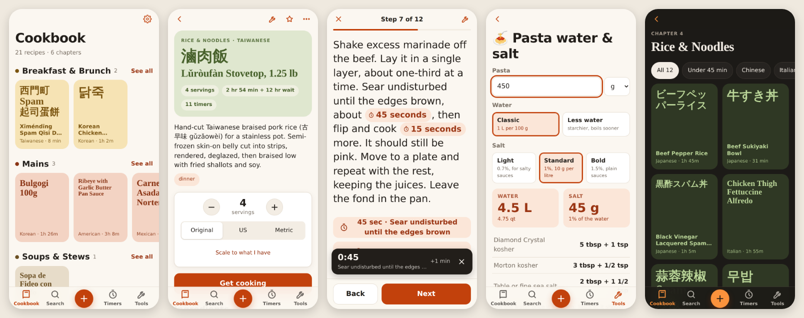

# Recipe Box

A home-screen app for keeping the recipe cards Claude makes, and cooking from them.



Claude shows recipes as interactive cards, but they live inside a chat. Recipe Box gives them a
permanent home. Copy a card, paste it in, and it keeps the same interactivity:

- **Servings scaling** that also rescales the amounts written inside the steps
- **Original / US / Metric** units
- **Get cooking**: gather everything first, then one step at a time, big text, swipe between
  steps, screen stays on
- **Tap-to-start timers** on every time mentioned in a step

Plus what a chat can't do:

- a **cookbook** in chapters (Breakfast & Brunch, Mains, Soups & Stews, Rice & Noodles, Salads &
  Sides, Desserts & Baking, Sauces & Basics), each dish shown by its own name: 滷肉飯, 닭죽, ビーフペッパーライス
- **search** across names in any script, ingredients, cuisines and equipment
- **scale to what you have**: "I have 700 g of pork belly" scales the whole recipe
- a **Timers** tab: every running timer says what it's for and opens its step; presets and your own timers
- **kitchen tools**: pasta water & salt, salt % for brines and ferments, cups ↔ grams, °F/°C and
  gas marks. Pin them to the 🧰 drawer on every recipe, where they use that recipe's amounts.
- a **shopping list**: add recipes (staples like salt and soy sauce left off), and it combines them
  ("Garlic · 8 cloves, for Lǔròufàn and Bulgogi"), sorts them by aisle and shares as text
- **favorites**, **tags**, **ingredient check-offs**, and **my tweaks** kept apart from Claude's notes
- a **cook log** (date, rating, what you changed, how it came out) for tuning a recipe over time
- the **whole cookbook offline**, not just the recipes you've opened

It's a static site on GitHub Pages with no build step, no dependencies and no server. Your
recipes are plain JSON files in your own repo, so they're versioned, portable, and never locked
into an app.

## Make your own

1. **Fork this repo** (or copy it). Then clear out my recipes:
   ```sh
   rm -rf recipes/*/ && node scripts/recipes.mjs reindex
   ```
   The app works with an empty library.
2. **Turn on GitHub Pages:** Settings → Pages → *Deploy from a branch* → `main` → `/ (root)`.
   A minute later the app is at `https://<you>.github.io/<repo>/`.
3. **Create a token so the app can save:**
   [github.com/settings/personal-access-tokens/new](https://github.com/settings/personal-access-tokens/new)
   - Repository access: *Only select repositories* → your fork
   - Repository permissions → **Contents: Read and write** (nothing else)
4. **On your iPhone:** open the Pages URL in Safari → Share → **Add to Home Screen**. Open the
   app from the home screen → ⚙︎ Settings → paste the token → **Test connection**.

Home-screen apps have their own storage, separate from Safari, so enter the token inside the
home-screen app.

## Adding a recipe

1. In Claude, open the recipe card and **switch it to Metric**. Grams are the card's real
   amounts; its ounce amounts are rounded conversions.
2. Copy the recipe text.
3. In Recipe Box tap **+** → **Paste**, check the chapter (its guess is picked), set servings if
   the card didn't say, and tags → **Save to &lt;chapter&gt;**.

Pasting a card you've saved before offers to update that recipe, keeping its cook log, favorite,
tags and tweaks. Recipes saved before chapters existed start in *Unsorted*; the sort screen
files them one tap each.

A PDF printed from the card also works, since it has the same text, but plain text is cleaner.

### Keeping the card's timers

The easiest way: give Claude the instructions in [docs/claude-instructions.md](docs/claude-instructions.md)
once (for example as a Project's instructions). Claude then writes every timer into its step
and ends the description with "Serves N.", so a plain copy keeps both.

For a card made without those instructions:

Copying a card leaves out its timer buttons, so plain copy/paste only finds times that are
written into a step's sentence ("simmer about 20 minutes"). To keep every timer the card shows:

1. On the Add screen, open **Keep the card's timers** → **Copy prompt for Claude**.
2. Send that prompt in the same Claude chat as the recipe. Claude replies with the card as JSON,
   including each step's timers and the servings.
3. Copy Claude's whole reply and paste it into Recipe Box.

When editing a recipe you can add a timer to any step by ending it with `⏱ 10 min` or
`[timer 10 min]`. "Copy as text" writes timers the same way, so they survive a round trip.

## Timers

Tap any time in a step (for example **20 minutes**). Timers run in the app and chime while it's
open, and in cooking mode the screen stays on. Each one is labelled with what it's for ("Braise
undisturbed · Lǔròufàn, step 9"); tap it to jump back to that step. The **Timers** tab lists them
all and has presets and timers of your own.

iOS pauses web apps in the background. For timers that ring with the app closed, switch
Settings → Timers → **iOS Clock** and create a shortcut named `Recipe Timer` in the Shortcuts
app: *Receive Text input → Get Numbers from Shortcut Input → Start Timer for (Numbers) seconds*.

## How recipes are stored

```
recipes/
  index.json                 one summary per recipe (what the cookbook loads)
  cookbook.json              optional: your own chapter names and order
  <id>/recipe.json           the parsed recipe, chapter, tags, servings, favorite, tweaks, cook log
  <id>/source.txt            the card text exactly as pasted, never edited
```

Every save is one commit covering all the files it touches. If another device saved in
between, the app rebuilds on top of that commit instead of overwriting it. Reads use the GitHub
API when a token is set, and the Pages copy otherwise. Both are cached for offline use, and in
the background the app keeps a copy of every recipe that changed, so the whole cookbook opens
offline. Per-device state (checked ingredients, chosen servings and units, running timers,
pinned tools, the shopping list) stays on the device.

To rename or reorder chapters, add `recipes/cookbook.json`:
`{ "chapters": [{ "id": "mains", "name": "Dinner" }, …] }`. Chapter ids are what recipes store.

When a new version of the app is published, it downloads in the background and offers
**Reload**.

## Security and privacy

- **Your recipes are public.** Free GitHub Pages needs a public repo, so anyone can read
  `recipes/`. Only token holders can change them.
- **The token stays on your device.** It's kept in the home-screen app's local storage and sent
  only to `api.github.com`. Use a fine-grained token limited to this one repo with only
  *Contents: Read and write*. Then the worst a leaked token can do is edit this repo, and you
  can revoke it on GitHub at any time.
- **Other pages on the same domain can read that storage.** Everything on
  `<you>.github.io` is one website to the browser, so any other Pages site you publish there
  could read the token. Don't host untrusted code on the same account's Pages, or use a
  custom domain for this app.
- **Hardening in the app:**
  - a Content-Security-Policy that allows scripts only from this site and network calls only
    to this site and the GitHub API
  - all recipe text rendered as plain text, never as HTML
  - only `http(s)` links accepted for the chat link
  - recipe ids validated before they become file paths
  - the app refuses to run inside another site's frame
- **Found a problem?** Please open an issue, or use GitHub's private vulnerability reporting
  if it's sensitive.

## From a computer

```sh
node scripts/recipes.mjs add card.txt --servings 4 --tags thai,dinner   # add a recipe
node scripts/recipes.mjs reindex                                        # rebuild recipes/index.json
node scripts/recipes.mjs refresh                                        # re-run the parser over saved recipes
node scripts/preview.mjs out/ --guess                                    # a read-only copy of the app and recipes, with guessed chapters
node scripts/screenshots.mjs                                             # rebuild docs/screenshots.png
npm test                                                                 # parser, units, tools, security tests (fixtures in tests/fixtures)
npm run test:e2e                                                         # the app in Chromium against a fake GitHub (needs Playwright)
python3 -m http.server                                                   # run locally on :8000
```

## Code

`index.html`, `styles.css`, and ES modules in `js/`:

| File | What it does |
| --- | --- |
| `parser.js` | Turns Claude recipe card text, or JSON from the export prompt, into a recipe: title parts, ingredients, steps, notes, servings. Links each step to the ingredients it mentions, finds timers and labels them. |
| `units.js` | Quantities, scaling (including to what you have), fractions, US/metric conversion. |
| `cookbook.js` | Chapters, and guessing a recipe's chapter, cuisine, equipment and time. |
| `shopping.js` | The shopping list: names to shop by, merging across recipes and units, aisles. |
| `store.js` | Reads and writes recipe files through the GitHub API, plus the offline copy. |
| `timers.js` | Kitchen timers, chime, screen wake lock. |
| `app.js` | The router; screens are in `views/` (cookbook, chapter, search, recipe, cooking, add/edit, sort, timers, tools, settings). |
| `tools/` | The kitchen tools. Each renders from `{ recipe }`; add one there and in `tools/index.js`. |
| `sw.js` | Service worker for offline use and updates. Bump `SHELL` with every change to the app's files. |

## License

[MIT](LICENSE)
